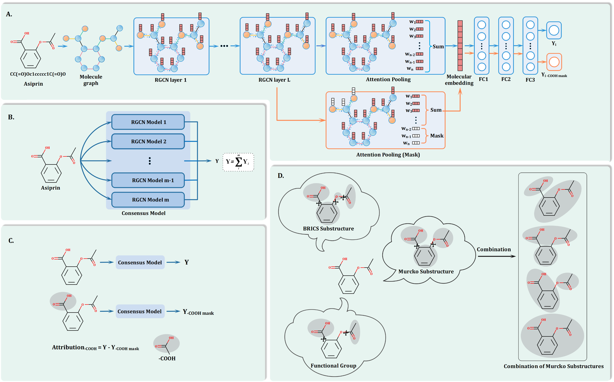

# Substructure Mask Explanation (SME)


- Overview

- Software Requirements

- Installation Guide

- Develop the molecular property prediction models and use the SME to explain the models

- Develop the drugbank substructure datasets based on SME for Prompt-MolOpt

Substructure-Mask Explanation (SME) is an intuitive and simple perturbation-based explanation methods that identifies the substructure affecting predictions. Three different molecular fragmentation methods, BRICS, Murcko Scaffold, and functional group, were used in SME to gain a more comprehensive understanding of the relationship between substructure and properties. In addition, by analyzing the contribution of functional groups across the entire dataset, we were able to understand how functional groups affected model predictions, which in turn provided guidance for structure optimization. Both the prediction results of the model and the real-world structure optimization results confirm that the contribution of functional groups can reasonably guide the structure optimization. Moreover, the recombination of the BRICS fragments with attribution assigned by SME can be used to generate molecules with desired properties, which provides a new way to generate molecules with desired properties that does not require training.





## Software Requirements

### OS Requirements

The package development version is tested on *Linux: Ubuntu 20.04* operating systems.

### Python Dependencies

Dependencies for Prompt-MolOpt:

```
python == 3.7
anaconda
dgl==0.7.1
rdkit==2020.09.1.0
pytorch=1.11.0
scikit-learn == 1.0.2
seaborn==0.11.2
numpy
pandas
scipy
```


## Installation Guide

### download this repo

```
git clone https://github.com/wzxxxx/Substructure-Mask-Explanation.git
```

Given the large size of the codebase, cloning via Git may be interrupted. Alternatively, consider downloading the ZIP file from the website and extracting it for use.

### install env

you can install the env via yaml file

```
cd Substructure-Mask-Explanation
conda env create -f SME.yaml
```


## Develop the molecular property prediction models and use the SME to explain the models

### 1. Build graph datasets

Assume that the project is at */root* and therefore the project path is */root/Substructure-Mask-Explanation*.

The task names of datasets used in **SME** are: ESOL, Mutagenicity, hERG and BBBP

The task names of datasets used in **Prompt-MolOpt** are: ESOL, Mutagenicity, hERG, BBBP, lipop and drugbank

```
cd /root/Substructure-Mask-Explanation/MaskGNN_interpretation
python build_graph_dataset.py --task_name ESOL
```

After that, the graph datasets will be saved at the */root/Substructure-Mask-Explanation/data/graph_data/*

### 2. Develop the molecular property prediction models (RGCN)

Develop the molecular property prediction models based on the following code:

```
cd /root/Substructure-Mask-Explanation/MaskGNN_interpretation
python Main.py --task_name ESOL
```

### 3. Calculate the attribution of different substructures base on SME

**For reproduction of** **SME**, the calculation of attribution of different datasets are as follows:

```
cd /root/Substructure-Mask-Explanation/MaskGNN_interpretation
python SMEG_explain_for_substructure.py # calculate the prediction of molecules with different substructures masked
python preciction_summary.py # summary the prediction of molecules with different substructures mask
python attribution_calculate.py # calculate the attribution of different substructures
```

 the datasets, models and prediction results can be downloaded from the following link for reproduction: https://pan.baidu.com/s/1xVmKr6bJdCKCT6ftRaKTbg 
Fetch code：wzxx. Some examples can be seen in *visualizaiton*.
These files can also be seen in https://drive.google.com/file/d/1HZaWkHZGx9rwfzikRQqcieJCY0jh2lpw/view?usp=sharing

And the visualization example of the SME can be see in /root/Substructure-Mask-Explanation/visualization.


## Develop the drugbank substructure datasets based on SME for Prompt-MolOpt

**For reproduction of** **Prompt-MolOpt**, taking the ESOL model as an example to develop the drugbank substructure datasets:

### 1. Build the graph datasets for drugbank

```
cd /root/Substructure-Mask-Explanation/MaskGNN_interpretation
python build_graph_dataset.py --task_name drugbank
```

### 2. Calculate the prediction of molecules with different substructures masked

```
cd /root/Substructure-Mask-Explanation/MaskGNN_interpretation
python SMEG_explain_for_substructure_for_Prompt_MolOpt.py --data_name drugbank --model_name ESOL
```

### 3. Calculate the prediction of molecules without masked

```
cd /root/Substructure-Mask-Explanation/MaskGNN_interpretation
python SMEG_for_mol.py --data_name drugbank --model_name ESOL
```

### 4. Calculate the attribution of different substructures and build the drugbank substructure datasets

```
cd /root/Substructure-Mask-Explanation/MaskGNN_interpretation
python build_substructure_datasets.py --data_name drugbank --model_name ESOL
```

The drugbank substructure dataset for ESOL property are saved as */root/Substructure-Mask-Explanation/prediction/summary/drugbank_ESOL_sub.csv*
